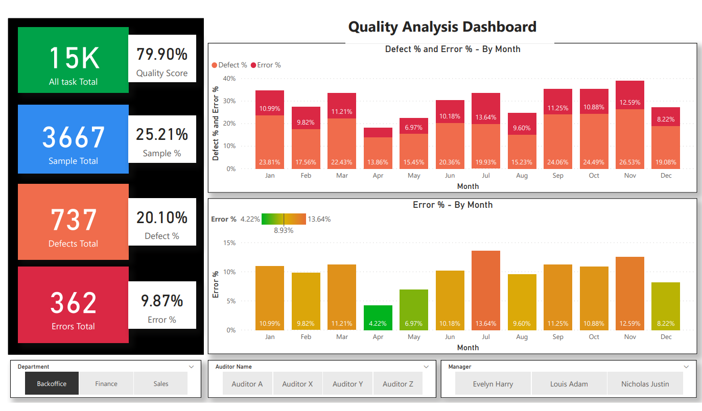
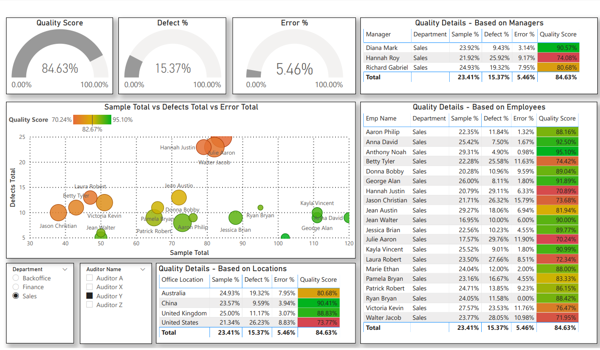
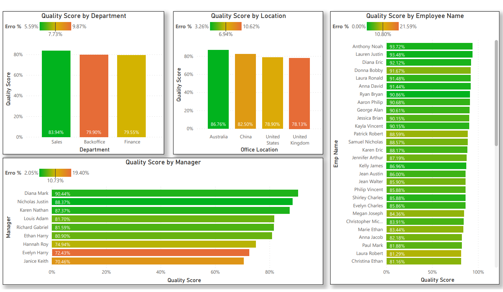

# Quality Analysis - Power BI Dashboard

## Objective
The primary objective of this Power BI dashboard is to analyze and derive insights from a dataset containing various features related to tasks, samples, defects, errors, and employee information within a company. Company operates across multiple departments, each responsible for executing various tasks critical to the company's operations. These tasks encompass a wide range of activities, from production processes to administrative functions. However, the company faces challenges in maintaining consistent task quality and efficiency, as evidenced by varying defect rates and error occurrences across departments and employee teams.

## Analysis Objectives
1. Task Performance Analysis:
Evaluate the frequency and types of tasks performed over time. Identify trends in task completion rates and variations across departments and auditors.

2. Defect and Error Analysis:
Investigate the relationship between defects, errors, and task types. Determine which tasks are more prone to defects and errors. Assess the impact of defects and errors on overall productivity.

3. Employee Productivity and Performance:
Analyze employee performance based on task completion rates, defects, and errors. Identify high-performing employees and areas for improvement.

4. Managerial Oversight:
Evaluate the effectiveness of managers in overseeing tasks and addressing defects and errors. Assess managerial responsiveness to issues identified during tasks.

5. Departmental Efficiency:
Compare the performance and efficiency of different departments based on task completion rates, defects, and errors. Identify departments that may require additional resources or process improvements.

6. Auditor Performance:
Assess the performance of auditors in identifying defects and errors during tasks. Determine whether certain auditors consistently perform better than others.

## Dashboard Snapshot

• Overall quality score: 79.90%

• Defect % and Error % by Month: This section shows the number of defects and errors, as well as thedefect and error rates, for each month. The defect rate is the number of defects divided by the total number of tasks, while the error rate is the number of errors divided by the total number of tasks. The month with the highest defect rate is March (23.81%) and the month with the highest error rate is December (26.53%).

• All tasks total: This section shows the total number of defects, errors, and tasks for all tasks. There are a total of 15,000 tasks, 3,667 defects, and 1,737 errors.

• Sample total: This section shows the same information as the "All tasks total" section, but for a sample of the data. There are a total of 366 samples, 362 errors, and 737 defects.

• Defect % by Month: This section shows the defect rate for each month. The month with the highest defect rate is March (23.81%) and the month with the lowest defect rate is September (15.23%).

• Error % by Month: This section shows the error rate for each month. The month with the highest error rate is December (26.53%) and the month with the lowest error rate is January (0%).

• Department: This section shows the department, auditor name, and manager for each auditor.

• Overall, the quality score is good, but there is room for improvement. The defect rate and error rate are highest in March and December, respectively. It is important to investigate why these rates are higher in these months and take steps to improve the quality of work in these months.

This dashboard shows the quality score of samples, defects, and errors, as well as a breakdown by managers, departments, employees, and locations.

• Overall quality score: 84.63%

• Defect rate: 15.37%

• Error rate: 5.46%

The report also shows that the quality score is higher for managers than for employees, and that the quality score is highest for the Sales department. The quality score is also higher for locations in China and the United Kingdom than for locations in the United States. It is important to note that this report only shows a snapshot of the quality data at a specific point in time. It is possible that the quality of the data has changed since the report was generated.

• Quality Score by Department: The Sales department has the highest quality score (83.94%), followed by Backoffice (79.90%) and Finance (79.55%).

• Quality Score by Location: China has the highest quality score (86.76%), followed by the United States (78.90%), the United Kingdom (78.13%), and Australia (77.55%).

• Quality Score by Employee Name: The employee with the highest quality score is Anthony Noah (93.72%), followed by Lauren Justin (93.48%) and Diana Eric (92.12%).

• Quality Score by Manager: The manager with the highest quality score is Kelly James (84.59%), followed by Karen Nathan (87.37%) and Nicholas Justin (88.37%).

• Overall, the data suggests that the Sales department, China, and Anthony Noah have the highest quality scores.

